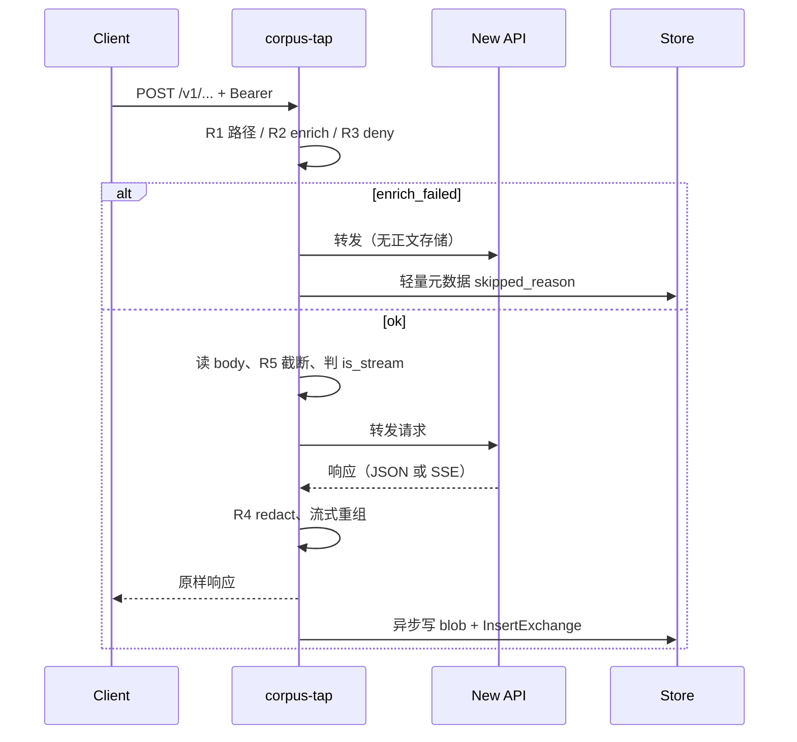

# Corpus Tap — 采集与存储设计（完整稿）

> **范围**：本文覆盖插件 **采集 + 存储** 全契约；**不含** 画像/分析 Worker 实现（仅 §16 扩展槽）。  
> **实现目录**：[`experiment/corpus-tap/`](.)  
> **部署上下文**（Compose、G2、与中转站关系）：[`docs/experiment/中转站语料采集插件设计.md`](../../docs/experiment/中转站语料采集插件设计.md)（索引 + 运维附录）

### 文档元信息

| 项 | 内容 |
|----|------|
| **编写日期** | 2026-06-04 |
| **状态** | 采集与存储设计定稿；实现 S0–S5 见 §15 |
| **New API 基线** | 与中转站原型一致；实施时锁定 `calciumion/new-api` digest |
| **复审触发** | 三主 POST wire 变更、存储布局变更、Token 表结构变更、合规/保留期策略变更 |

---

## 1. 目标

### 1.1 要达成什么

| 目标 | 说明 |
|------|------|
| **全量留档** | 对三种主推理 POST，保存客户端请求与模型响应的 **原文**（含流式重组结果） |
| **按人分桶** | 每条记录绑定 New API **`user_id`**（及 `token_id`），作为领域微调与后续画像/分析的 **分区键** |
| **长期可用** | 存储形态同时服务 **语料清洗、用户画像、运营分析**——Tap 只写 **事实字段**，不写结论字段 |
| **不挡推理** | 存储失败仍转发；可切换 **仅转发** 模式 |
| **插上即用** | 不改 New API；对外入口改为 Tap 端口，路径与 Token 不变 |

### 1.2 明确不做（采集层）

- 抽问答对、质量打分、去重、领域分类、语言/PII 识别  
- 内容审核、智能抽样、训练集版本管理  
- 替代 New API 计费 `logs`  
- 热路径内调用任何 LLM  

清洗、画像、分析均为 **只读消费** 已落盘数据（画像/分析实现见 §16 扩展槽）。

---

## 2. 存储长期契约

下游三条管线 **共用同一套原始矿 + 元数据索引**，Tap 采集期遵守：

| 原则 | 说明 |
|------|------|
| **正文与索引分离** | 大 payload 只在对象存储（gzip）；PostgreSQL 存指针、哈希、维度、状态 |
| **路径稳定** | `deployment_id / user_id= / dt= / exchange_id /` 不变；扩展前缀另建（`exports/`、`profiles/` 不由 Tap 写） |
| **只存事实** | 如 `wire`、`status_code`、`model_name`、`latency_ms`、`truncated`；**不** 存 `domain_label`、`quality_score` |
| **可复现** | `tap_deployment` 记录 New API / Tap 镜像版本；`exchange_id` 全局唯一 |
| **可拼会话** | `session_key` 支持客户端 `X-Corpus-Session-Id` 或 Tap 生成键，供离线多轮拼接 |
| **可审计** | 每对象 `sha256`；`skipped_reason` / `store_error` 可观测 |
| **脱敏一层** | 入库前 R4（见 §7）；下游可再加规则，但不依赖 Tap 重做语义清洗 |

### 2.1 下游只读消费方式

| 下游 | 读什么 | Tap 必须保证 |
|------|--------|----------------|
| **语料清洗 / SFT** | `client_request` + `upstream_response` 或 `assembled_stream`（SSE 原始） | 按 `user_id`+时间列出；URI 可解析；**语义还原在分析层** |
| **画像（未来）** | 上列 + `http_exchange` 聚合统计 | 元数据足够做确定性 `stats`；`sample_exchange_ids` 由 Worker 填，非 Tap |
| **分析（未来）** | 同上 + 可选异步 enrich 字段 | `enrich_json` 可补 `channel_id`、token 数等，不阻塞转发 |

---

## 3. 拓扑

### 3.1 数据流

```text
  Client (Bearer 平台 Token)
        │  可选: X-Corpus-Session-Id
        ▼
  ┌──────────────────────────────────────┐
  │  corpus-tap :8443                     │
  │    1. rules → enrich → 读 body        │
  │    2. 同步转发 → New API :3000          │
  │    3. 读响应（含 SSE 重组）              │
  │    4. redact → 异步 store              │
  └──────────────┬───────────────────────┘
                 │
     ┌───────────┴───────────┐
     ▼                       ▼
  corpus-db (PostgreSQL)   对象存储 (S3 / MinIO / 本地 file://)
  http_exchange 索引        *.json.gz 正文
```

### 3.2 插上步骤

1. Compose 增加 `corpus-tap`、`corpus-db`、对象存储（或 `CORPUS_TAP_LOCAL_DATA_DIR` 仅开发）。  
2. `CORPUS_TAP_UPSTREAM=http://new-api:3000`（或前置 domain-guard）。  
3. 对外 API 入口从 `:3000` 改为 Tap `:8443`；New API 仅内网。

---

## 4. 请求生命周期



**不变量**：

- 客户端收到的 **状态码、头、body（含 SSE 流）** 与直连 New API 一致（Tap 不改协议）。  
- `Persist` 失败只写 `store_error`，**不** 改变已发出的响应。  
- `CORPUS_TAP_MODE=proxy-only` 时跳过 4，仅转发。

---

## 5. 模块架构

```text
experiment/corpus-tap/
├── cmd/corpus-tap/              # L0 入口
├── cmd/corpus-profile/          # L1 profile 策略
├── internal/
│   ├── proxy/ capture/ enrich/ rules/ redact/   # 仅 Tap
│   ├── store/                   # 事实层 + analysis_profile.go
│   ├── analysis/shared/         # 闸门、SSE
│   ├── analysis/profile/        # profile 策略
│   └── config/                  # Load() / LoadProfile()
├── analysis/                    # 架构与各策略 DESIGN
└── migrations/schema.sql          # 全量建库，见 migrations/README.md
```

| 包 | 职责 |
|----|------|
| **proxy** | 路由分发；capture vs proxy-only；上游超时 0（长连接）；`healthz` / `readyz` |
| **rules** | 是否采集、wire 类型、流式判定、体积策略 |
| **enrich** | 同步归属；响应后 `newapi_request_id`；可选异步 enrich worker |
| **capture** | 组装 `Record`；调用 store；**不** 阻塞响应完成后的 goroutine 以外逻辑 |
| **redact** | 存储前脱敏 |
| **store** | Blob 写入 + `http_exchange` 插入；重试与 `store_error` |

### 5.1 异步写入

| 项 | 设计 |
|----|------|
| 触发 | 响应已写回客户端 **之后** `go Persist(...)` |
| 队列 | 有界 channel + N 个 worker（默认 N=4，可 `CORPUS_TAP_STORE_WORKERS`） |
| 背压 | 队列满时 **丢弃异步写**、记 `store_error=queue_full`，**不** 阻塞 HTTP |
| 顺序 | 同一 `exchange_id` 的 blob 与 DB 行由单次 Persist 事务性提交（先 blob 后 DB；DB 失败时 blob 保留，行内记 `store_error`） |

---

## 6. 采集规则（R1–R7）

规则在 **写库前** 顺序执行。命中「不存全文」时 **仍转发** New API。

| ID | 规则 | 默认 | 行为 |
|----|------|------|------|
| **R1** | 路径 | 仅 POST | 采集：`/v1/chat/completions`、`/v1/messages`、`/v1/responses`；兼容 `POST /messages`（anthropic base 无 `/v1`）。其余方法/路径 **不采** |
| **R2** | 归属 | 必须 `user_id` | 失败：`skipped_reason=enrich_failed`，不存 body，仍转发 |
| **R3** | 开关 | 全开 | `CORPUS_TAP_DENY_USER_IDS`、`CORPUS_TAP_DENY_TOKEN_IDS` 命中则不存 |
| **R4** | 脱敏 | 开 | 见 §7 |
| **R5** | 体积 | 32MiB/body | `CORPUS_TAP_MAX_BODY_BYTES`；超限：`CORPUS_TAP_ON_OVERSIZE=truncate`（默认）或 `skip` |
| **R6** | 保留期 | 90 天 | `retention_until = created_at + RETENTION_DAYS`；S3 生命周期规则与 DB 一致 |
| **R7** | 流式 | 全量重组 | 见 §8 |

**禁止在 rules 实现**：最短 prompt、重复检测、领域/语言模型、PII NER。

### 6.1 Wire 映射

| 路径后缀 | `http_exchange.wire` |
|----------|----------------------|
| `/chat/completions` | `openai_chat` |
| `/messages` | `anthropic_messages` |
| `/responses` | `openai_responses` |

---

## 7. 脱敏（R4）

### 7.1 请求头（存储侧）

- **不存** `Authorization`；可选存脱敏后的 `request_headers.json.gz`（`CORPUS_TAP_STORE_HEADERS=true` 时）。  
- 透传上游时 **保留** 原始头。

### 7.2 Body JSON

对 **存入对象** 的 JSON 文本做键名匹配（大小写不敏感），值替换为 `"[REDACTED]"`：

`api_key`, `apikey`, `secret`, `password`, `token`, `access_token`, `refresh_token`, `private_key`, `client_secret`

实现注意：仅处理 JSON string 值；非 JSON body（罕见）原样存或标 `content_type=opaque`。

### 7.3 不替代合规流程

R4 为 **最小** 脱敏；法务要求的删除/匿名化在 **离线** 完成。

---

## 8. 归属（enrich）

### 8.1 同步（阻塞转发前）

| 优先级 | 方式 | 说明 |
|--------|------|------|
| 1 | **MySQL 只读** `tokens` | `CORPUS_TAP_NEWAPI_MYSQL_DSN`；`SELECT user_id, id FROM tokens WHERE key = ?`（与 New API `TokenAuth` 同一 key，含 `sk-` 规范化） |
| 2 | **开发占位** | `CORPUS_TAP_DEV_USER_ID`；**禁止** 生产依赖 |
| 3 | 失败 | `enrich_failed`，见 R2 |

同时解析 `CORPUS_TAP_DENY_TOKEN_IDS`（需 token id）。

### 8.2 响应后（同一次 Persist）

| 字段 | 来源 |
|------|------|
| `newapi_request_id` | 响应头 `X-Request-Id` / `X-Oneapi-Request-Id` 或 body 内 `id`（按锁定 digest 集成测试定一种） |
| `upstream_request_id` | 若响应含 OpenAI `x-request-id` 等，可选记入 |
| `status_code`, `latency_ms` | 实测 |

### 8.3 可选异步（独立 goroutine / cron）

从 New API `logs` 只读副本 **回填** `http_exchange.enrich_json`：

```json
{
  "channel_id": 3,
  "prompt_tokens": 1200,
  "completion_tokens": 400,
  "quota": 1.5,
  "log_id": 98765
}
```

**不阻塞** 转发；失败可重试。画像/分析可读此字段，但不得作为采集前置条件。

### 8.4 会话键 `session_key`

| 来源 | 规则 |
|------|------|
| 请求头 `X-Corpus-Session-Id` | trim 后原样使用 |
| 无 | `tap_request_id`（单轮）或离线用 `user_id+token_id+dt` 聚合 |

Tap **不** 解析 chat 轮次。

### 8.5 模型名

从请求 body JSON 提取 `model`（三种 wire 均为顶层字段），写入 `model_name`。提取失败则空字符串。

---

## 9. 流式（R7）

### 9.1 判定 `is_stream`

满足任一即为流式：

- `Accept` 含 `text/event-stream`  
- body 含 `"stream":true`（宽松 JSON 子串检测，与现骨架一致）

### 9.2 捕获策略

| 模式 | 存储对象 | 说明 |
|------|----------|------|
| **非流式** | `upstream_response.json.gz` | 完整响应 body |
| **流式** | `assembled_stream.txt.gz` | **tee 捕获的原始 SSE 字节流**（与转发给客户端的 chunk 序列一致）；**不是**已重组的纯文本对话 |
| **可选** | `upstream_sse_raw.json.gz` | `CORPUS_TAP_STORE_SSE_RAW=true` 时与上同源（实现别名） |

**与分析层分工（定稿）**：Tap **只保证字节完整、可审计**；将 SSE 解析为助手可读文本由分析层 [`internal/analysis/shared/sse.go`](./internal/analysis/shared/sse.go) 完成。下游不得假设 `assembled_stream` 可直接做 SFT/RAG。

### 9.3 转发与内存

- 实现：**tee** 到客户端 + 内存/spool 捕获（见 `internal/proxy/stream.go`）。  
- 超 `CORPUS_TAP_SSE_SPOOL_MEM_BYTES` 可落盘 spool；单流上限 `CORPUS_TAP_MAX_STREAM_BYTES`，超限 `truncated=true`。

---

## 10. 数据模型

### 10.1 PostgreSQL

全量 DDL：[`migrations/schema.sql`](./migrations/schema.sql)。

| 表 | 用途 |
|----|------|
| `tap_deployment` | 每次进程启动可插入一行，或复用 `CORPUS_TAP_DEPLOYMENT_ID` 固定 UUID |
| `http_exchange` | 一次 HTTP 交换一行；分析 **只读** |

### 10.2 `http_exchange` 字段语义

| 列 | 阶段 | 说明 |
|----|------|------|
| `id` | 001 | `exchange_id`，与对象目录名一致 |
| `deployment_id` | 001 | 关联部署快照 |
| `created_at` | 001 | UTC |
| `retention_until` | 002 | R6 |
| `user_id`, `token_id` | 001 | 分桶键 |
| `tap_request_id` | 001 | Tap 生成 UUID |
| `newapi_request_id` | 001/响应后 | 对账 New API |
| `upstream_request_id` | 001 | 可选 |
| `session_key` | 001 | §8.4 |
| `endpoint`, `wire` | 001 | |
| `is_stream` | 001 | |
| `status_code`, `latency_ms` | 001 | |
| `model_name` | 002 | 从 body 提取（001 中 `model_header` 迁移后废弃或同义填） |
| `client_bytes`, `response_bytes` | 002 | 脱敏后字节数 |
| `client_request_uri` 等 | 001 | blob 指针 |
| `*_sha256` | 001 | 明文 sha256（脱敏后） |
| `truncated` | 001 | R5/R7 |
| `skipped_reason` | 001 | 非空即未存全文 |
| `store_error` | 001 | 存储失败 |
| `enrich_json` | 002 | 异步回填 |
| `enrich_at` | 002 | 回填时间 |

索引（002 追加）：`(user_id, created_at DESC)`、`(wire, created_at)`、`(retention_until)` WHERE `skipped_reason IS NULL`。

### 10.3 对象存储布局

```text
s3://<bucket>/<deployment_id>/user_id=<uid>/dt=YYYY-MM-DD/<exchange_id>/
  client_request.json.gz          # 必填（除 enrich_failed）
  upstream_response.json.gz       # 非流式
  assembled_stream.txt.gz         # 流式重组
  upstream_sse_raw.json.gz        # 可选
  request_headers.json.gz         # 可选
```

**本地开发**（`file://`）：与上相同相对路径，根目录 `CORPUS_TAP_LOCAL_DATA_DIR`。

对象元数据（S3 user metadata）：`sha256`, `wire`, `exchange_id`, `user_id`。

### 10.4 保留期（R6）

- DB：`retention_until` 由插入时计算。  
- S3：生命周期规则删除 `deployment_id/` 下对象；**禁止** 公网读。  
- 导出/法律_hold：离线标记，Tap 不实现 hold 逻辑（未来 `legal_hold` 列可放 003）。

---

## 11. 离线导出契约

供清洗管道 **直接消费**（实现为 CLI `corpus-tap export` 或内网 HTTP）。

### 11.1 清单行（JSONL）

每行一条交换：

```json
{
  "exchange_id": "uuid",
  "user_id": 12,
  "token_id": 3,
  "session_key": "…",
  "endpoint": "/v1/messages",
  "wire": "anthropic_messages",
  "is_stream": true,
  "model_name": "claude-sonnet-4-20250514",
  "created_at": "2026-06-04T12:00:00Z",
  "retention_until": "2026-09-02T12:00:00Z",
  "status_code": 200,
  "latency_ms": 8421,
  "truncated": false,
  "uris": {
    "client_request": "s3://bucket/…/client_request.json.gz",
    "upstream_response": null,
    "assembled_stream": "s3://bucket/…/assembled_stream.txt.gz"
  },
  "sha256": {
    "client_request": "…",
    "assembled_stream": "…"
  },
  "enrich_json": { "prompt_tokens": 100, "completion_tokens": 50 }
}
```

### 11.2 查询参数

| 参数 | 说明 |
|------|------|
| `user_id` | 必填（可多值逗号分隔） |
| `from` / `to` | ISO8601，过滤 `created_at` |
| `wire` | 可选过滤 |
| `include_skipped` | 默认 false |

---

## 12. 对外接口

### 12.1 数据面（用户 API）

| 项 | 值 |
|----|-----|
| 监听 | `CORPUS_TAP_LISTEN`，默认 `:8443` |
| 行为 | 除 `/healthz`、`/readyz`、`/internal/*` 外，**原样反向代理** 至 `CORPUS_TAP_UPSTREAM` |

### 12.2 运维面（内网 + `CORPUS_TAP_ADMIN_KEY`）

| 方法 | 路径 | 说明 |
|------|------|------|
| GET | `/healthz` | 进程存活 |
| GET | `/readyz` | upstream + PostgreSQL + blob 后端可达 |
| GET | `/internal/stats` | `?user_id=` 计数、最近 `created_at`、错误率 |
| GET | `/internal/export` | §11 流式 JSONL |
| POST | `/internal/reload-enrich` | 触发异步 enrich 批（可选） |

---

## 13. 配置

### 13.1 环境变量

| 变量 | 必填 | 默认 | 说明 |
|------|------|------|------|
| `CORPUS_TAP_UPSTREAM` | ✅ | — | New API 根 URL |
| `CORPUS_TAP_DATABASE_URL` | 生产 ✅ | — | PostgreSQL |
| `CORPUS_TAP_S3_BUCKET` | 生产 ✅ | — | 与 `LOCAL_DATA_DIR` 二选一为主后端 |
| `CORPUS_TAP_S3_REGION` | 配 S3 时 ✅ | — | |
| `CORPUS_TAP_S3_ENDPOINT` | | — | MinIO 兼容 |
| `CORPUS_TAP_LOCAL_DATA_DIR` | 开发 | `./data` | 无 S3 时 |
| `CORPUS_TAP_NEWAPI_MYSQL_DSN` | 生产推荐 | — | 只读 `tokens` |
| `CORPUS_TAP_DEV_USER_ID` | 本地 | — | **仅开发** |
| `CORPUS_TAP_DEPLOYMENT_ID` | | 启动插入 UUID | 固定部署 id |
| `CORPUS_TAP_LISTEN` | | `:8443` | |
| `CORPUS_TAP_MODE` | | 正常 | `proxy-only` 只转发 |
| `CORPUS_TAP_MAX_BODY_BYTES` | | `33554432` | R5 |
| `CORPUS_TAP_ON_OVERSIZE` | | `truncate` | `truncate` \| `skip` |
| `CORPUS_TAP_MAX_STREAM_BYTES` | | `67108864` | R7 |
| `CORPUS_TAP_RETENTION_DAYS` | | `90` | R6 |
| `CORPUS_TAP_DENY_USER_IDS` | | — | R3 |
| `CORPUS_TAP_DENY_TOKEN_IDS` | | — | R3 |
| `CORPUS_TAP_STORE_WORKERS` | | `4` | 异步写 |
| `CORPUS_TAP_STORE_HEADERS` | | `false` | 存脱敏头 |
| `CORPUS_TAP_STORE_SSE_RAW` | | `false` | 原始 SSE |
| `CORPUS_TAP_NEWAPI_IMAGE` | | — | 写入 `tap_deployment` |
| `CORPUS_TAP_IMAGE` | | — | 写入 `tap_deployment` |
| `CORPUS_TAP_ADMIN_KEY` | 生产推荐 | — | 内网 API |

### 13.2 故障模式

| 场景 | 行为 |
|------|------|
| PostgreSQL 不可用 | 若 blob 可写：仅写 S3 + `store_error`；若都不可用：仍转发，`store_error` |
| S3 不可用 | 仍转发；记 `store_error`；可选降级本地 spool（`CORPUS_TAP_SPOOL_DIR`，P2） |
| 队列满 | `store_error=queue_full`，仍转发 |
| Tap 进程崩溃 | 客户端重试；**无** 语料不阻塞业务 |
| 运维旁路 | `CORPUS_TAP_MODE=proxy-only` |

---

## 14. 部署要点

- 镜像：[`Dockerfile`](./Dockerfile)，入口 `corpus-tap`。  
- Compose 片段：[`deploy/docker-compose.snippet.yml`](./deploy/docker-compose.snippet.yml)。  
- 依赖：`corpus-db` 健康后启动 Tap；`new-api` 已监听 3000。  
- TLS：建议在 Tap 前置 Caddy，或 Tap 终止 TLS（P2）。  
- 网络：Tap → new-api、corpus-db、S3、MySQL 只读；**不对** 公网暴露 PostgreSQL。

---

## 15. 实施阶段与实现差距

| 阶段 | 交付 | 实现状态 |
|------|------|----------|
| **S0** | 透明代理 + `healthz` + `proxy-only` | ✅ |
| **S1** | R1/R2/R3、落盘、本地/S3 布局、`001` 元数据 | ✅ |
| **S2** | MySQL token enrich、R4 脱敏、`model_name`、响应头 `newapi_request_id` | ✅ |
| **S3** | R7 流式 tee（边写边捕）、S3 后端、`readyz` | ✅ |
| **S4** | `002` 迁移、R6 `retention_until`、logs enrich、`/internal/export` | ✅ |
| **S5** | 有界队列、`/internal/stats`、Compose | ✅ |

### 15.1 已知局限

| 项 | 说明 |
|----|------|
| 超大 SSE | `CORPUS_TAP_SSE_SPOOL_DIR` + `CORPUS_TAP_SSE_SPOOL_MEM_BYTES` 内存阈值后落盘 |
| `enrich_failed` | 无 `user_id` 时不写 PostgreSQL 行（仅日志） |
| logs 回填 | 依赖 New API `logs.request_id` 与 Tap 响应头一致；表结构随版本需集成测试 |
| `oversize`+`skip` | 已实现：`Content-Length` 与 chunked 探测；超限仍完整转发上游 |
| 流式判定 | 请求 Accept/body **或** 响应 `Content-Type: text/event-stream` |
| `CORPUS_TAP_DEPLOYMENT_ID` | 固定 UUID 时 `ResolveDeployment` upsert，不每次新建部署行 |
| P1 冒烟 | `go test` 内 `TestSmokeE2E`；全栈 `make smoke` + [`testdata/NEWAPI_BASELINE.md`](./testdata/NEWAPI_BASELINE.md) |
| Token 校验 | `status=1` 且 `expired_time` 未过期 |
| 代理路径元数据 | `forwardAndEnqueue` 记录上游 `status_code` |

---

## 16. 扩展槽（非本文实现范围）

以下 **只读** 本文存储契约；实现时不修改 Tap 热路径。

| 槽位 | 路径 / 迁移 | 说明 |
|------|-------------|------|
| 分析层 | [`analysis/ARCHITECTURE.md`](./analysis/ARCHITECTURE.md) | 多策略只读事实层；共享 `internal/analysis/shared` |
| 策略 profile | [`analysis/profile/DESIGN.md`](./analysis/profile/DESIGN.md) | `corpus-profile`：`internal/analysis/profile/` |
| 金库出口（L2） | [`migrations/schema.sql`](./migrations/schema.sql) 视图 | `v_gold_rag_chunks`、`v_gold_sft_candidates` |
| 其他策略 | `analysis/<id>/` + 独立表或 `unified_conclusions` | 见 [`analysis/ARCHITECTURE.md`](./analysis/ARCHITECTURE.md) §5 |
| 契约索引 | [`docs/experiment/中转站语料采集插件设计.md`](../../docs/experiment/中转站语料采集插件设计.md) §2 | Compose、G2 出站 |

**约束**：扩展 Worker **不得** import `proxy`；**不得** 使用 `CORPUS_TAP_UPSTREAM` 或用户 Bearer。

---

## 17. 采集与存储验收清单

- [ ] `POST /v1/messages` 后，`http_exchange` 有行且 `user_id` 来自真实 Token（非 DEV）  
- [ ] 对象路径含 `user_id=<n>/dt=…/<exchange_id>/client_request.json.gz`  
- [ ] 非流式存在 `upstream_response.json.gz`；流式存在 `assembled_stream.txt.gz`  
- [ ] `exchange_id` 与对象目录、DB `id` 一致  
- [ ] `Authorization` 不出现在存盘的 body/头中  
- [ ] S3/DB 故障时 `curl` 推理仍 200（可能无库）  
- [ ] `proxy-only` 下无新 `http_exchange` 行  
- [ ] `/internal/export?user_id=` 返回 §11 JSONL  

---

## 参考

- New API `model/token.go`、`model/log.go`（只读 enrich 对照）  
- [`migrations/schema.sql`](./migrations/schema.sql)
